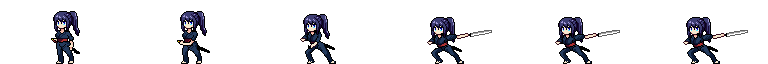
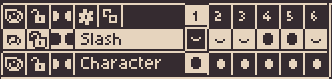

# 🎮 Aseprite Tool: Layer-Based Sprite Export

This project showcases a custom Lua script designed for Aseprite to assist in modular sprite exports. It was developed as a simple Technical Artist portfolio piece to demonstrate both programming capability and understanding of 2D game pipelines.

---

## 🧩 Overview

In 2D games—especially those with anime-style aesthetics—characters and effects are often built from multiple visual layers (e.g., base sprite, VFX, equipment). Managing and exporting these layers efficiently is essential for animation, rigging, and game integration.

This tool automates the process by:
- Exporting each visible **layer as a separate PNG**
- Optionally generating **JSON metadata** for integration
- Supporting a modular asset pipeline used in studios like Cygames or other anime-inspired games

---

## 🖼️ Sample Assets & Outputs

### 🎞️ Original Animation Preview

---

### 🧍 Character Sprite (Merged Layers)

---

### ✨ Slash Effect Sprite (Separated)

---

### 🧱 レイヤー構成（Aseprite内）

- **Slash** — White sword trail VFX
- **Character** — Main sprite with animation frames
- Layers are **separated and exported individually** using the custom Lua script.

These assets were exported using a custom Lua script in Aseprite, separating character and visual effects for modular use in game engines.

---

# 🎮 Aseprite ツール：レイヤー分離によるスプライトエクスポート

このプロジェクトでは、Aseprite 用に開発したカスタム Lua スクリプトを用いて、スプライトをモジュール形式でエクスポートできるツールを紹介しています。  
本ツールは、**プログラミングスキル**と**2Dゲーム制作におけるパイプラインの理解**をアピールするための、簡単なテクニカルアーティスト向けポートフォリオ作品として作成しました。

---

## 🧩 概要

2Dゲーム、特にアニメ調のタイトルにおいては、キャラクターやエフェクトは複数の視覚的なレイヤー（例：ベースキャラ、VFX、装備）によって構成されることが一般的です。  
それらを効率的に管理・エクスポートすることは、**アニメーション**や**リギング**、**ゲームエンジン統合**において非常に重要です。

このツールでは以下のことが可能です：

- 表示中の各レイヤーを**個別のPNGファイル**としてエクスポート  
- 必要に応じて**JSON形式のメタデータ**を生成  
- Cygames や他のアニメ系ゲームスタジオに見られるような、**モジュラーアセットパイプライン**に対応  

---

## 🖼️ 出力例

### 🎞️ 元アニメーションのプレビュー

---

### 🧍 キャラクタースプライト（統合レイヤー）

---

### ✨ 斬撃エフェクト（分離レイヤー）

---

### 🧱 レイヤー構成（Aseprite内）

- **Slash（スラッシュ）**：剣の残像などのVFX用  
- **Character（キャラクター）**：本体のスプライトとアニメーション  
- 各レイヤーは**個別に自動エクスポート**されます

このように、キャラクターとエフェクトを分離してエクスポートすることで、ゲームエンジン上での**再利用性**や**管理のしやすさ**が大きく向上します。

---
